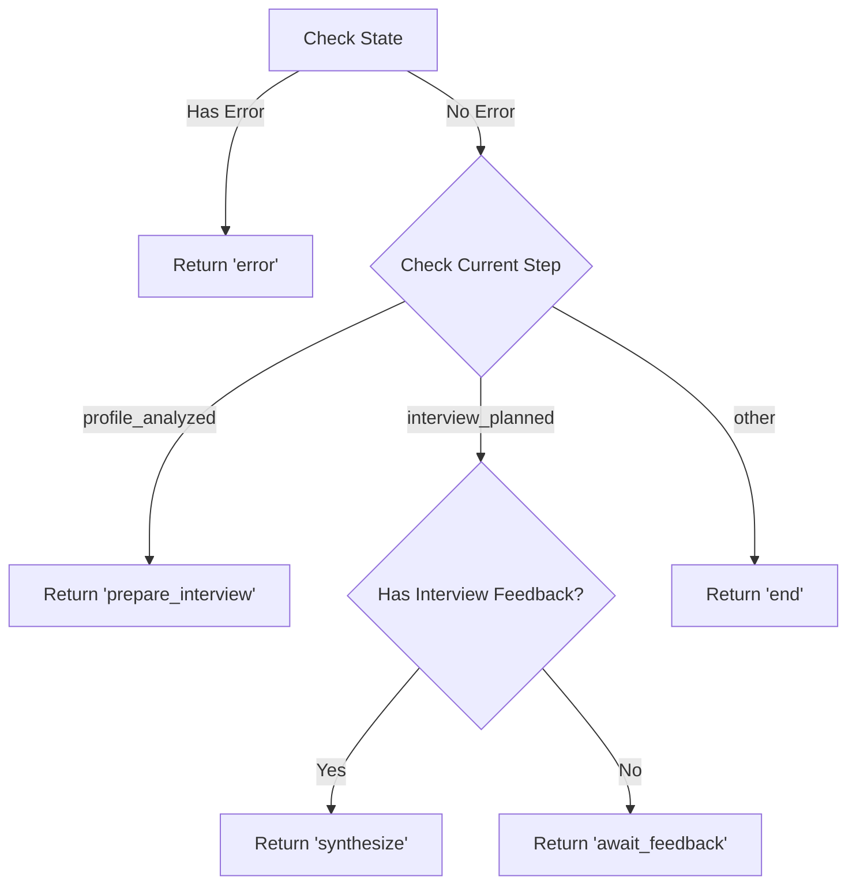

```mermaid
flowchart TD
    A[Check State] -->|Has Error| B[Return 'error']
    A -->|No Error| C{Check Current Step}
    C -->|profile_analyzed| D[Return 'prepare_interview']
    C -->|interview_planned| E{Has Interview Feedback?}
    E -->|Yes| F[Return 'synthesize']
    E -->|No| G[Return 'await_feedback']
    C -->|other| H[Return 'end']
```